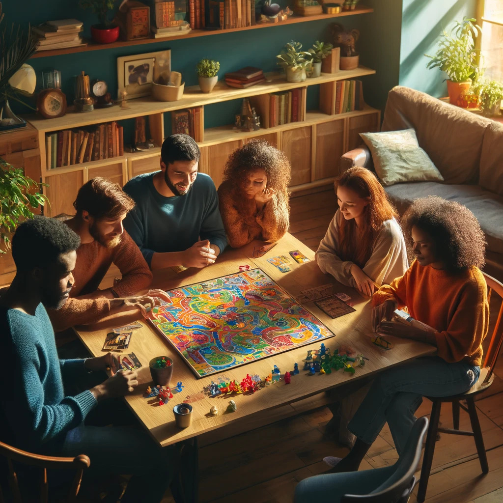

# snapshot-chronicles

## Installation
1. Download and install [Miniconda](https://docs.anaconda.com/free/miniconda/miniconda-install/)
2. After installing Miniconda, install required libraries to run our application with the following command in the terminal ```conda env create -f environment.yml```. Please note that this enviroment file works on M1 Mac, and it should work on other platform. If there is a problem installing necessary libraries from the environment file, please look at ```app.py``` to manually install all the libraries imported at the top of the file.
3. Run the following command in the terminal to export your OpenAI API key as an environment variable with the following command ```export OPENAI_API_KEY=xxx``` and replace ```xxx``` with your own API key.
3. Then, run the following command in the terminal to launch our application ```python -m flask run```. The terminal should show the following message: ```* Running on http://127.0.0.1:5000```. It is possible that the port number may be different. Open the link in a browser.

## Alternative Method for Running the Application
All of our code is contained in the ```CIS_7000_E2E.ipynb``` notebook. The functionality is the same as running our web application. The web application only provides a simple interface for uploading an image. If the website application gives an error, please open the notebook in [Google Colab](https://colab.research.google.com/) and run all the cells. Our code relies on Javascript to take a photo of the user, so please open the notebook in Google colab. The final result will be saved into a pdf. Please note that the notebook requires an OpenAI API key.

## Potential Problems with Running the Web Application
1. DALLE-3 augments the user prompt while generating an image, so it is possible that during this process, the augemented prompt triggers the DALLE-3 safety warning. We found this issue to be more prevalent in our web application but less in the jupyter notebook. If this problem occurs, please try resubmitting the photo or use the ```CIS_7000_E2E.ipynb``` jupyter notebook.
2. Although we enforced the output format in our prompt, GPT hallucination may break our output processing code such as returning a response not following our specified JSON format. If this problem occurs, please try resubmitting the photo or use the ```CIS_7000_E2E.ipynb``` jupyter notebook.

## Sample Output
We used ```character.jpg``` in the ```uploads``` directory as the sample user input image. The image is shown below



The ```sample_output``` directory has everything we've generated for the above user input image. ```char_img_0.jpg```, ```char_img_1.jpg```, ```char_img_2.jpg```, ```char_img_3.jpg```, ```char_img_4.jpg```, ```char_img_5.jpg``` are the generated character images in lego style.

 ```loc_1.jpg```,  ```loc_2.jpg```,  ```loc_3.jpg```,  ```loc_4.jpg``` are the map location images. 

 ```rpg_ruleset.pdf``` is our final output that contains everything.